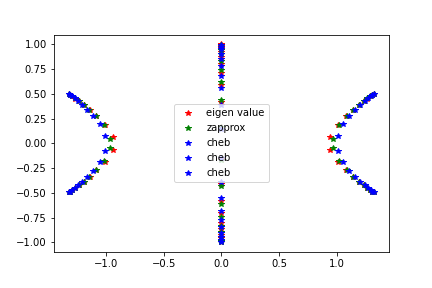

<!DOCTYPE html>
<html>
<head>

</head>
<body>

<h2>The spectra of tridiagonal k-Toeplitz matrices</h2>

  Chain models can be represented by a tridiagonal matrix with periodic entries along its diagonals. Eigen modes of open chains are represented by spectra of such tridiagonal k-Toeplitz matrices, where k represents length of the repeated unit, allowing for a maximum of k distinct types of elements in the chain. Eigen values of tridiagonal k-Toeplitz matrices are found with low computational effort .Characteristic equations of such matrices of increasing dimensions are reduced into a three-term polynomial recurrence relation with a k th order coefficient polynomial and establish existence of a limiting spectrum, nature of its convergence, and a continuous support along with at most 2k distinct points containing the limiting spectra. The k curves traced due to recurrence conditions on the k th order coefficient polynomial converge tightly with the limiting eigenvalue distribution for dimensions significantly larger than k. The coefficients of this polynomial also establish the necessary and sufficient conditions for any two tridiagonal k-Toeplitz matrices of same period k, to have the same limiting spectrum. Extend these results to relations for numerically approximating roots of such polynomials for any given n. General solutions for the evaluation are motivated by large computational efforts and errors in the iterative numerical methods. Later, we apply this solution to the eigenvalue problems represented by tridiagonal matrices with a periodicity k in its entries, providing a more accurate numerical method for evaluation of spectra of chains and a reduction in computational effort from O(n2) to O(n).
  

	
<figure>
	
    <figcaption>Comparison between builtin eigen values and achieved eigenvalues is given </figcaption>
</figure>

</body>
</html>
 
